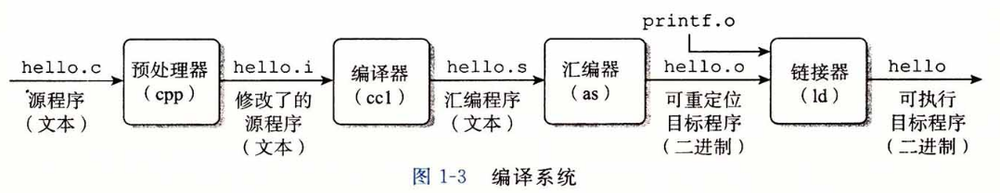
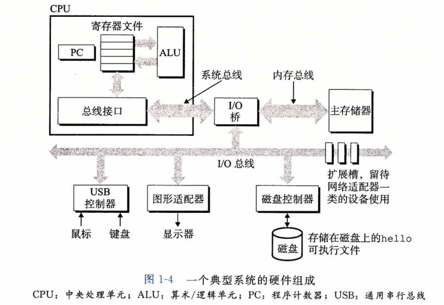
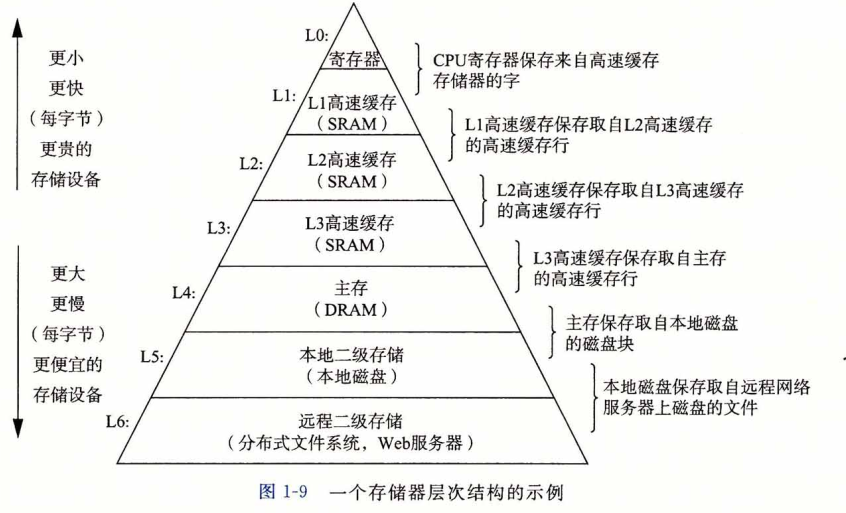
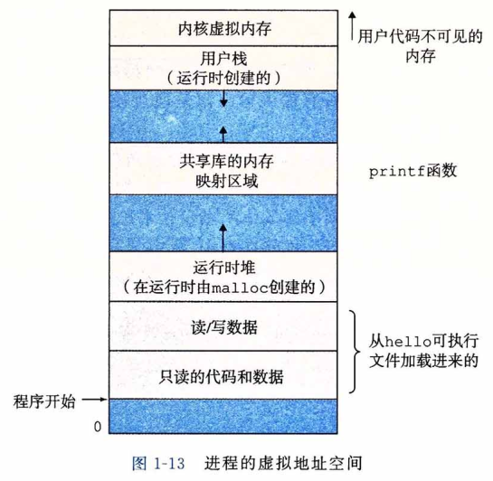
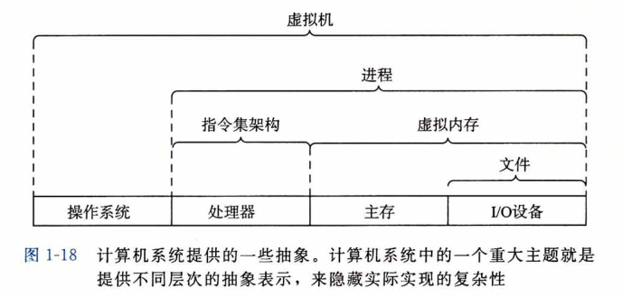

# 第一章：计算机系统漫游

记录一些**我觉得**的**关键**知识点。

## 1.2 程序被其他程序翻译成不同的格式

我们写好了`hello.c`文件后，使用`GCC`编译器对其进行编译

```
gcc -o hello hello.c
```

然后程序会经历以下的生命周期：



其中：

- 预处理阶段：使用预处理器，把代码中如`#include<stdio.h>`文件中的内容，直接插入程序中，得到了另一个 C 程序，以 `.i` 结尾。
- 编译阶段：编译器将文本文件`hello.i`翻译成`hello.s`，包含一个汇编语言程序。
- 汇编阶段：汇编器（as）将`hello.s`翻译成机器语言指令，并且把程序打包成**可重定位目标程序**，保存在`hello.o`中，这是一个二进制文件。
- 链接阶段：hello调用了`printf`函数，这是每个编译器都提供好的标准C库的函数，`printf`函数存在于一个`printf.o`的文件中。连接器（ld）就负责这种合并，结果是得到一个二进制文件，最后被加载到内存中，被系统执行。

## 1.3 了解编译系统如何工作是大有益处的

- 优化程序性能：了解一些编译器是如何转换代码的，可以使程序员更加了解底层。
- 理解链接时出现的错误：
  - 了解一些关于链接器所做的工作
  - 链接器无法解析一个引用，这是什么含义
  - 静态变量和全局变量的区别
  - 不同的C文件中定义了两个相同的两个全局变量会发生什么
  - 静态库和动态库的区别是什么
  - 为什么有些链接错误等到程序运行的时候才出现
- 避免安全漏洞：
  - 了解堆栈原理、缓冲区溢出错误
  - 学习程序员、编译器和操作系统可以用来降低攻击威胁的方法

## 1.4 处理器读并解释储存在内存中的指令

### 1.4.1 系统硬件的组成

1. 总线：一组电子管道，携带信息字节，负责在各个部件中传递
2. I/O设备：系统与外界世界连接的设备，比如鼠标键盘显示器。
3. 主存：就是内存，处理器执行程序时，存放程序和程序处理的数据
4. 处理器：处理指令。





## 1.7 操作系统管理硬件

操作系统有两个基本功能：

- 防止硬件被失控的应用程序乱用
- 向应用程序提供简单一致的机制来控制复杂而又通常大不相同的硬件设备。操作系统通过几个基本的抽象概念来实现这些：进程、虚拟内存和文件。
  - 文件是对 I/O 设备的抽象表示
  - 虚拟内存是对主存和磁盘I/O设备的抽象表示
  - 进程是对处理器、主存和I/O设备的抽象表示

### 1.7.1 进程

操作系统提供一种假象：系统上只有这个程序在运行，程序看上去是独占处理器、主存和I/O设备。处理器看上去是不间断的一条一条执行程序中的指令，这些假象是通过**进程**这个概念来实现的。

**进程是操作系统对于一个正在运行着的程序的一种抽象。**在一个系统中可以同时运行多个进程，每个进程好像都在独占硬件。

**并发运行**指的是一个进程的指令和另一个进程的指令是交错运行的。在大多数系统中，需要运行的进程数是多余可以运行他们的CPU个数的。一个核心的概念是：CPU同一时刻只能执行一个程序，执行多个程序是通过进程间的切换来进行的，操作系统实现这种交错执行的机制，被称之为**「上下文切换」**。

一个进程运行需要保存一些进程运行的信息，这种信息被称为**上下文**，包括PC和寄存器文件的当前值，所以操作系统在把控制权从一个进程切换到另一个进程时，需要保存当前进程的上下文，恢复新进程的上下文。

从一个进程切换到另一个进程的转换是由操作系统的内核（Kernel）来完成的，内核是操作系统代码常驻主存的部分。当应用程序需要操作系统的某些操作时，比如读写文件，就执行一条特殊的系统调用指令，将控制权给内核，然后内核执行完毕之后反击给应用程序。**内核不是一个独立的进程，他是系统管理全部进程所用代码和数据结构的集合。**

### 1.7.2 线程

现代系统中，一个进程实际上可以由多个称之为线程的执行单元组成。每个线程，都运行在进程的上下文中，并且共享同样的代码和全局数据。在网络服务器中，对并行处理的请求，线程成为越来越重要的编程模型。因为多线程比多进程更容易共享数据，也因为一般线程比进程高效。

### 1.7.3 虚拟内存

虚拟内存是一个抽象概念，它为每个进程提供了一种假象，即每个进程都在独占的使用主存。每个进程看到的内存都是一致的，称为**虚拟地址空间**。下图是Linux的虚拟地址空间。在Linux中，最上面的是保留给操作系统的代码和数据的，这对于所有进程来说都是一样的，地址空间的底部区域存放用户进程定义的代码和数据。



每个区域有不同的作用，自底向上介绍：

- **程序代码和数据**：对于所有进程来说，代码是从同一固定地址开始，紧接着是和C全局变量对应的数据的位置。代码和数据区是按照可执行目标文件的内容初始化的。
- **堆**：代码和数据区后紧随着的是运行堆。代码和数据区一开始就被指定了大小，当调用`malloc`和`free`的时候，堆可以动态的进行扩展和收缩。
- **共享库**：在地址空间的中间部分来存放像C标准库和数学库这样的共享库的代码和数据区。
- **栈**：位于用户虚拟地址空间的顶部是用户栈，编译器用他来实现函数调用，用户栈在程序运行时可以动态的扩展和收缩。每次调用一个函数，栈会增长，从一个函数返回时，栈会收缩。
- **内核虚拟内存**：顶部区域是为内核保留的，不允许应用程序来读写这个区域。他们必须调用内核来执行相应操作。

### 1.7.4 文件

文件就是字节序列，仅此而已。每个 I/O 设备，包括磁盘、键盘、显示器甚至网络，都可以看成文件。系统中所有的输入输出都是通过使用一小组 Unix I/O 的系统函数调用读写文件来实现的。

### 1.9.2 并发和并行

术语「并发」是一个通用的概念，指一个同时具有多个活动的系统；术语「并行」指的是用并发来使一个系统运行的更快。并行可以在计算机系统的多个抽象层次上运用，重点有三个层次：

#### 线程级并发

构建在进程这个抽象之上，可以设计出同时有多个程序执行的系统，这就导致了并行。使用线程，甚至可以在一个进程中控制多个控制流。

单处理器系统只，只有一个CPU核心，并发是通过时间片的切换来模拟出来的。

多处理器系统有多个单系统组成，把多个CPU集成在一个芯片上，称为「多核」

**超线程**：是一项允许一个CPU执行多个控制流的技术。是指每个CPU核心没有满负荷运载时，其剩余用量可以模拟成虚拟的核心。比如因特尔的`i7`处理器，有4个核心，，实际上可以并行执行8个线程。

多处理器从两方面提高了系统的性能：

1. 减少了在执行多个任务时，模拟并发的需要
2. 可以使应用程序运行的更快（前提是程序编写要以多线程来编写）。

#### 指令级并发

现代处理器可以执行多个指令，被称为指令级并行，如果一个处理器在一个时钟周期得到比执行1条指令更快的速度，就称之为「超标量」

#### 单指令、多数据并行

### 1.9.3 计算机系统中抽象的重要性




